# Diagram Templates

This reference provides Mermaid diagram patterns and templates for visualizing different types of system architectures.

## Architecture Diagram Types

### System Context Diagrams
Use for showing high-level system boundaries and external interactions:

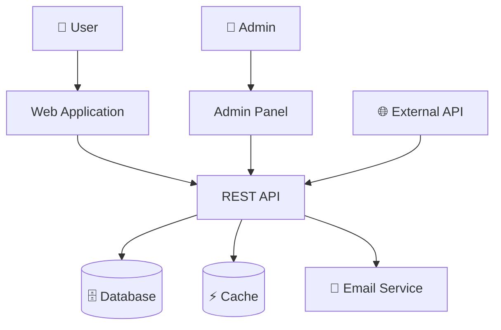

### Layered Architecture
Use for traditional n-tier applications:

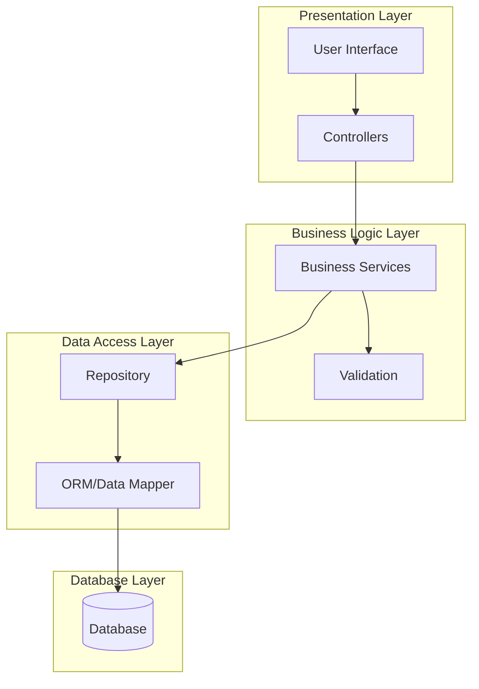

### Microservices Architecture
Use for distributed service architectures:

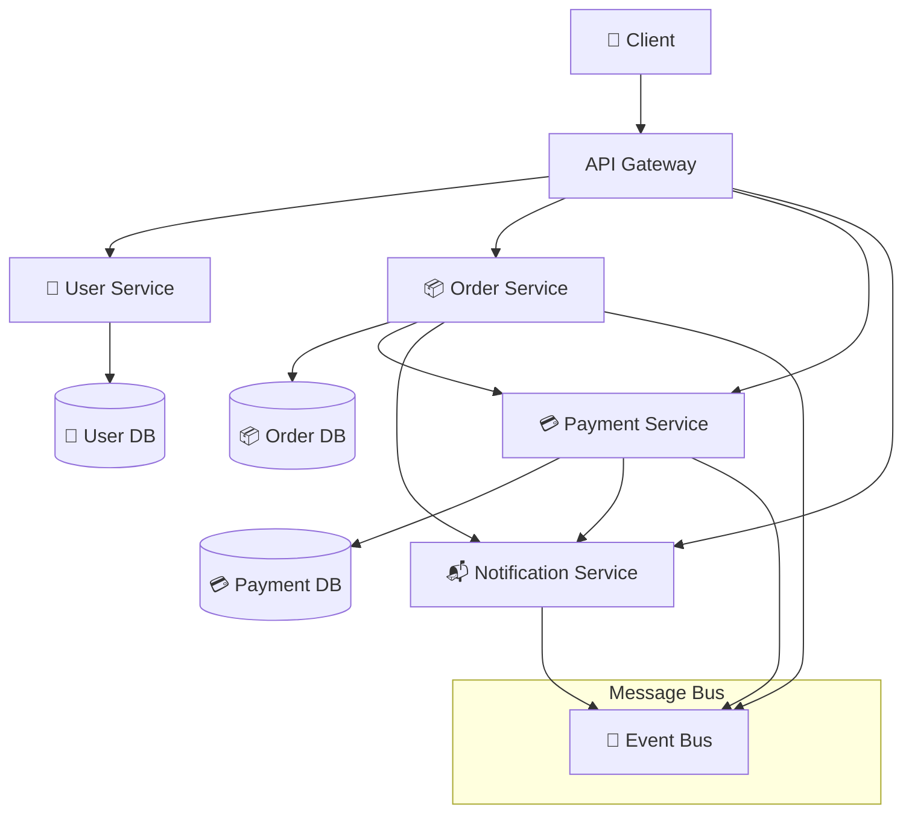

### Component Architecture
Use for showing internal component relationships:

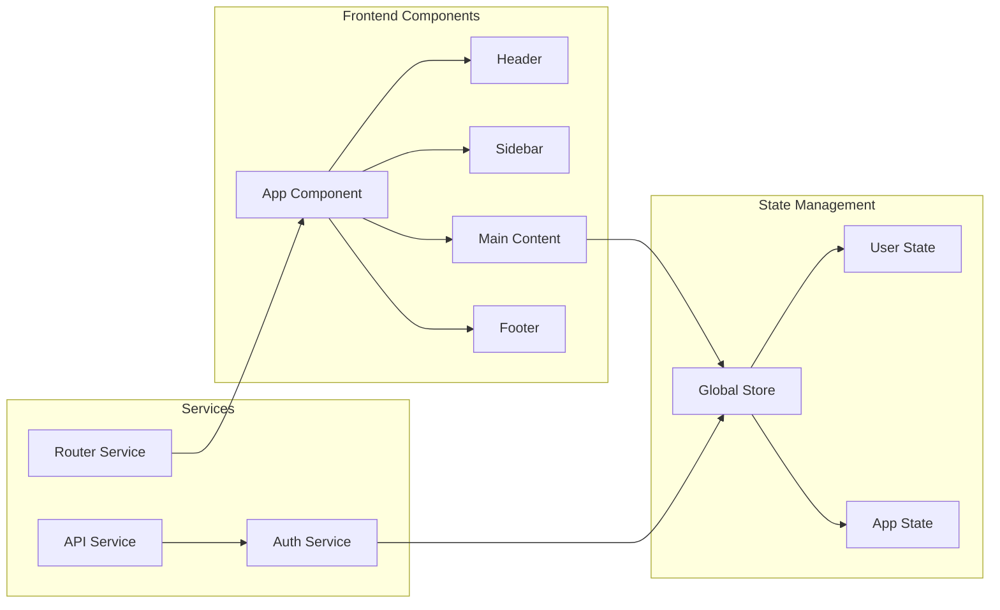

## Data Flow Diagrams

### Request-Response Flow
Use for showing how requests flow through the system:

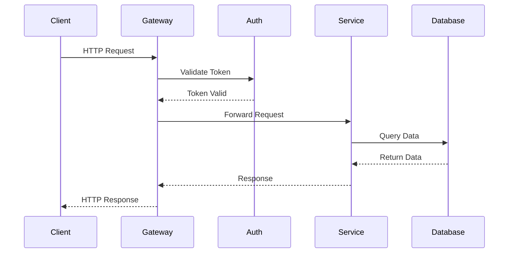

### Event-Driven Flow
Use for asynchronous, event-based architectures:

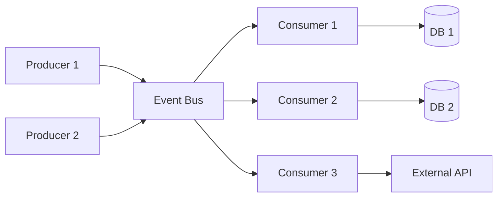

## Database Architecture

### Relational Database Schema
Use for showing table relationships:

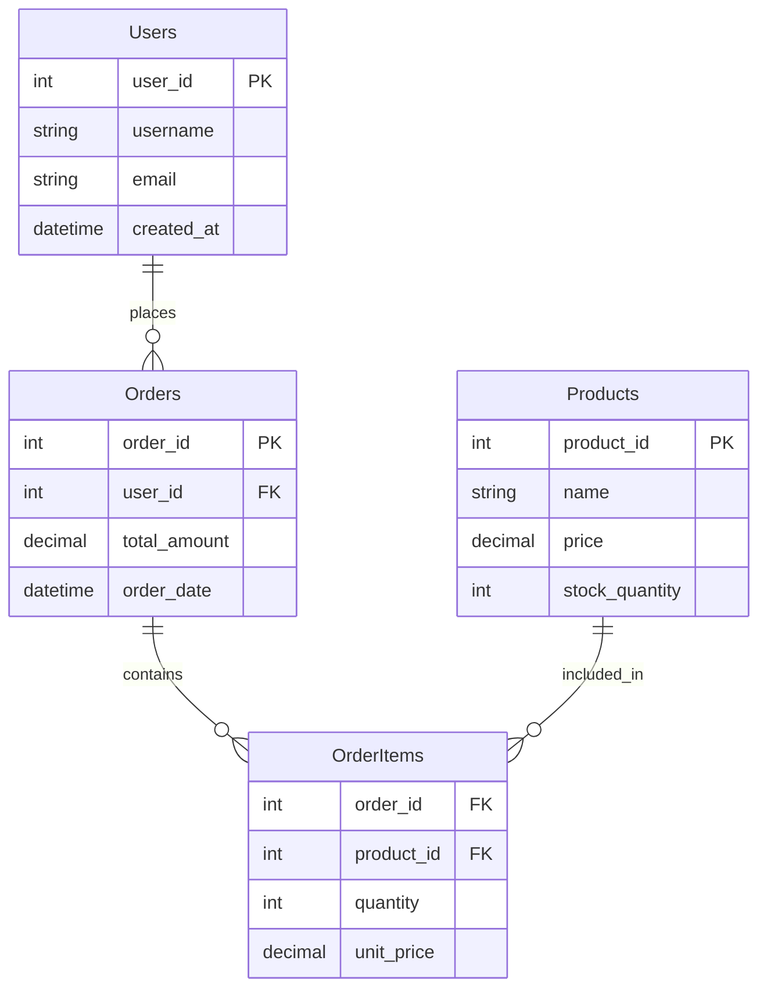

### NoSQL Database Structure
Use for showing document relationships:

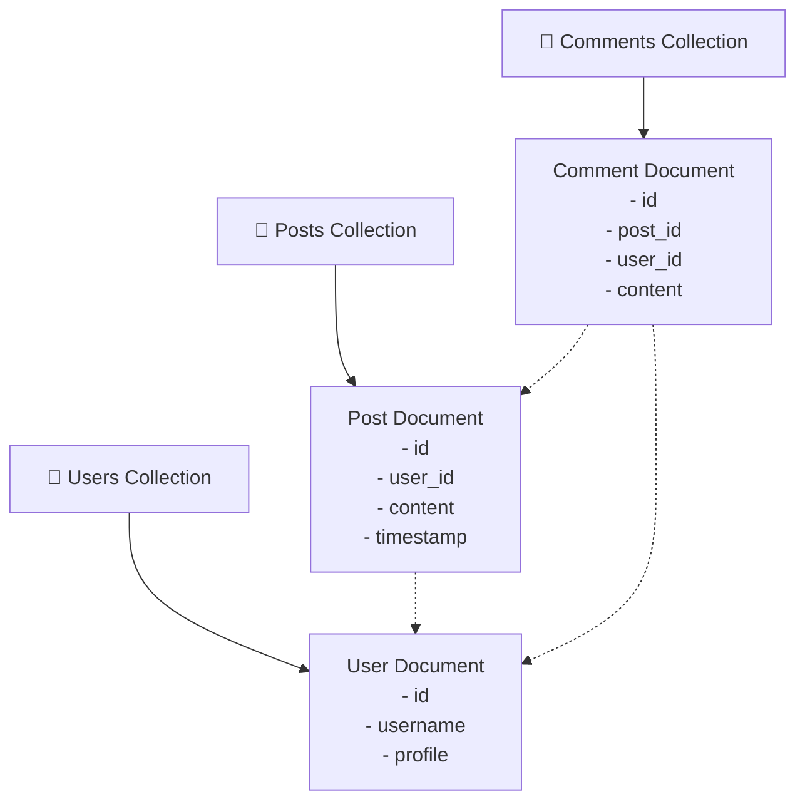

## Deployment Architecture

### Cloud Infrastructure
Use for showing cloud deployment structure:

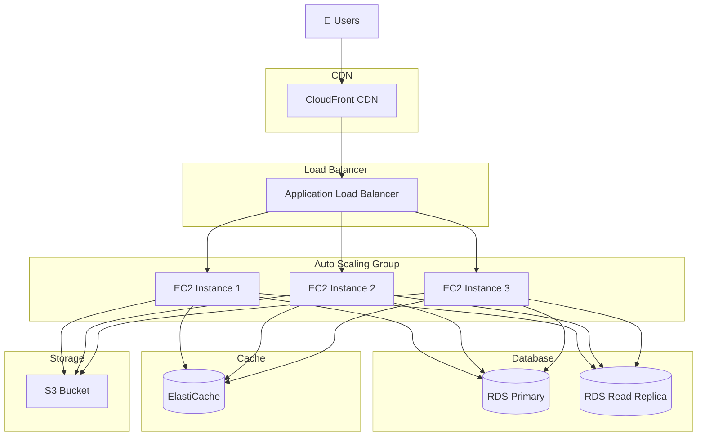

### Container Orchestration
Use for Docker/Kubernetes deployments:

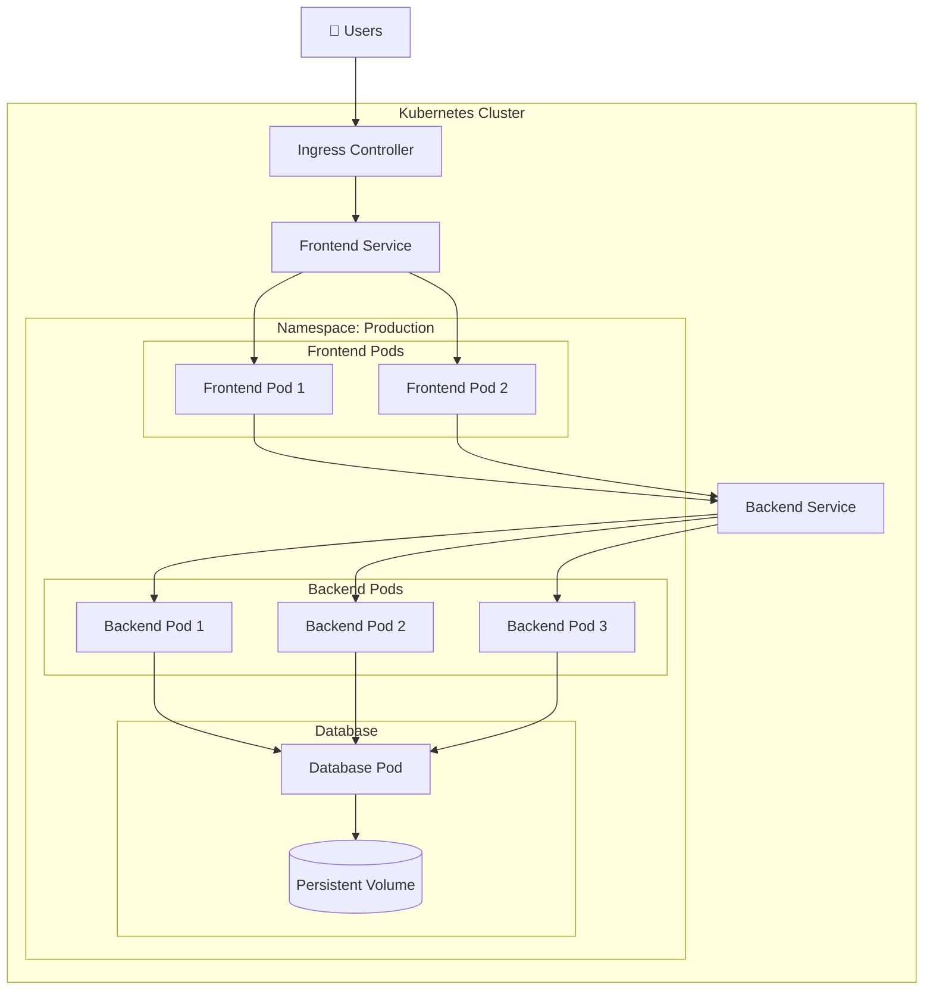

## Security Architecture

### Authentication Flow
Use for showing authentication and authorization:

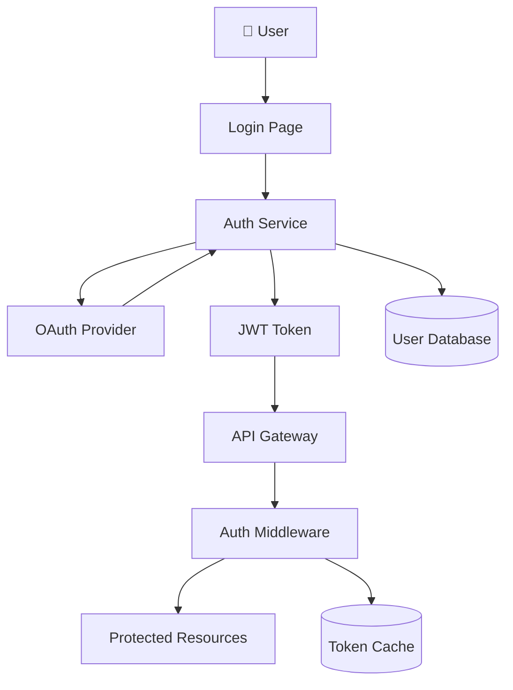

## Performance Architecture

### Caching Strategy
Use for showing caching layers:

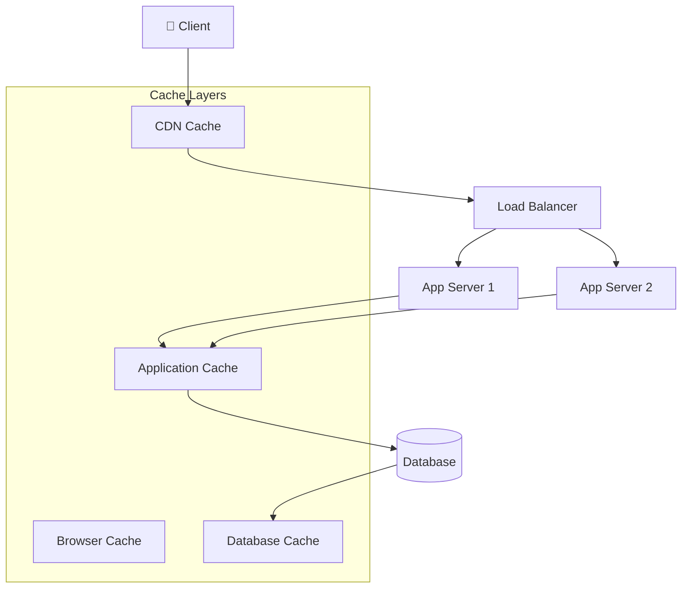

## Template Selection Guide

**Choose diagram type based on analysis focus:**

- **System Context**: High-level overview, external dependencies
- **Layered Architecture**: Traditional applications with clear layers
- **Microservices**: Distributed systems with multiple services
- **Component**: Frontend applications, modular systems
- **Request-Response Flow**: API interactions, synchronous processing
- **Event-Driven Flow**: Asynchronous systems, message queues
- **Database Schema**: Data relationships, data architecture
- **Deployment**: Infrastructure, hosting, scalability
- **Security**: Authentication, authorization, security controls
- **Performance**: Caching, optimization, bottlenecks