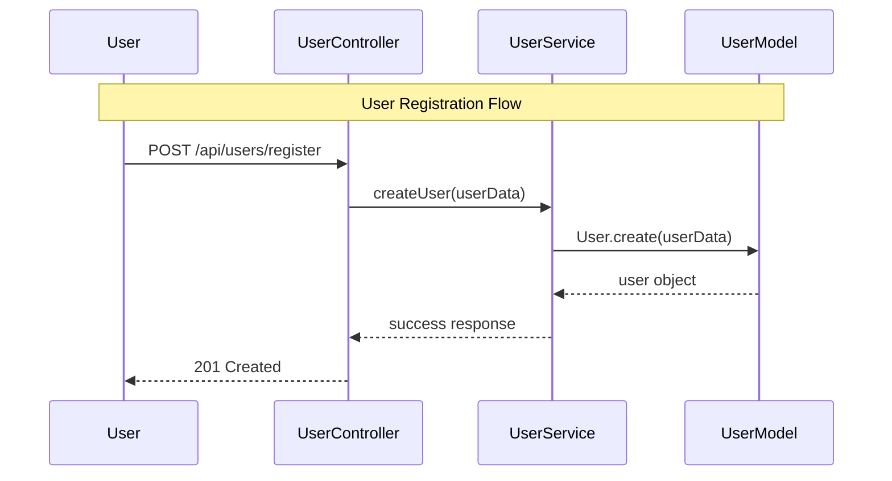
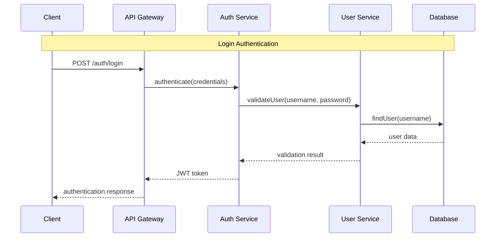

# Enhanced Diagram Generation Patterns

This reference provides comprehensive guidance for creating detailed architectural visualizations using Mermaid diagrams.

## Component Architecture Diagrams

### Component Categorization for Visual Organization

**Entry Points** (Diamond Shape, Red):
- Main application files: `main.py`, `app.py`, `server.js`, `index.js`
- Application bootstrapping and initialization
- System entry and configuration loading

**API Components** (Hexagon Shape, Pink):
- Controllers: `UserController.py`, `OrderController.js`
- Route handlers: `routes.py`, `api.ts`
- HTTP endpoint definitions and request handling

**Service Components** (Rectangle, Purple):
- Business logic: `UserService.py`, `PaymentService.js`
- Core application functionality
- Business rule implementation

**Data Models** (Database Shape, Green):
- Database entities: `User.py`, `Order.js`
- Schema definitions and data access
- ORM models and database interactions

**UI Components** (Circle, Blue):
- React components: `UserProfile.jsx`, `Dashboard.tsx`  
- Frontend views and user interface elements
- Component hierarchies and state management

**Configuration** (Trapezoid, Orange):
- Settings files: `config.py`, `settings.json`, `.env`
- Environment configuration and constants
- Application parameters and feature flags

### Visual Relationship Types

**Critical Dependencies** (Thick Arrows):
- Core system relationships that must not break
- High-impact dependencies affecting multiple components
- Infrastructure components used throughout system

**Important Dependencies** (Standard Arrows):
- Normal component relationships
- Business logic flows between layers
- Standard import/export relationships

**Optional Dependencies** (Dotted Arrows):
- Utility and helper relationships
- Optional integrations and plugins
- Development-only dependencies

### Sample Architecture Diagram

```mermaid
graph TD
    %% Entry Points
    Main[\"main.py\"]:::entry
    Server[\"server.js\"]:::entry
    
    %% API Layer
    UserAPI{\"UserController\"}:::api
    OrderAPI{\"OrderController\"}:::api
    AuthAPI{\"AuthController\"}:::api
    
    %% Service Layer
    UserService[\"UserService\"]:::service
    OrderService[\"OrderService\"]:::service
    EmailService[\"EmailService\"]:::service
    
    %% Data Layer
    UserModel[(\"User\")]:::data
    OrderModel[(\"Order\")]:::data
    Database[(\"PostgreSQL\")]:::data
    
    %% UI Layer
    Dashboard(\"Dashboard\"):::ui
    Profile(\"UserProfile\"):::ui
    
    %% Configuration
    Config[/\"config.py\"/]:::config
    
    %% Critical Dependencies
    Main ==> UserAPI
    Server ==> AuthAPI
    
    %% Important Dependencies
    UserAPI --> UserService
    OrderAPI --> OrderService
    UserService --> UserModel
    OrderService --> OrderModel
    
    %% Optional Dependencies
    UserService -.-> EmailService
    EmailService -.-> Config

    classDef entry fill:#ff6b6b,stroke:#d63031,stroke-width:3px,color:#fff
    classDef api fill:#fd79a8,stroke:#e84393,stroke-width:2px,color:#fff
    classDef service fill:#6c5ce7,stroke:#5f3dc4,stroke-width:2px,color:#fff
    classDef data fill:#00b894,stroke:#00a085,stroke-width:2px,color:#fff
    classDef ui fill:#74b9ff,stroke:#0984e3,stroke-width:2px,color:#fff
    classDef config fill:#fdcb6e,stroke:#e17055,stroke-width:1px,color:#fff
```

## Dependency Relationship Diagrams

### Layered Architecture Visualization

**Presentation Layer** (Frontend/UI):
- React components, Angular modules, Vue components
- User interface and user experience elements
- Client-side state management

**API Layer** (Interface):
- REST endpoints, GraphQL resolvers, RPC handlers
- Request/response mapping and validation
- External interface definitions

**Business Layer** (Core Logic):
- Domain services, business rules, workflows
- Application logic and business processes
- Use case implementations

**Data Layer** (Persistence):
- Database models, repositories, data access
- Data persistence and retrieval logic
- External data source integrations

### Connection Strength Indicators

**Heavy Dependencies** (Triple Arrow `===>`):
- 5+ functions used from target component
- Critical path dependencies
- High coupling relationships

**Medium Dependencies** (Double Arrow `-->`):
- 2-4 functions used from target component
- Standard business relationships
- Normal coupling levels

**Light Dependencies** (Single Arrow `->`):
- 1 function used or occasional access
- Utility and helper relationships
- Low coupling interactions

### Sample Dependency Diagram

```mermaid
flowchart LR
    subgraph Presentation
        Dashboard[\"Dashboard<br/>(8 deps)\"]:::high
        Profile[\"UserProfile<br/>(3 deps)\"]:::medium
    end
    
    subgraph API
        UserCtrl[\"UserController<br/>(5 deps)\"]:::high
        AuthCtrl[\"AuthController<br/>(2 deps)\"]:::medium
    end
    
    subgraph Business
        UserSvc[\"UserService<br/>(7 deps)\"]:::high
        AuthSvc[\"AuthService<br/>(4 deps)\"]:::medium
    end
    
    subgraph Data
        UserModel[\"User<br/>(1 dep)\"]:::low
        Database[\"PostgreSQL\"]:::low
    end
    
    %% Layer Interactions
    Dashboard ===> UserCtrl
    Profile --> UserCtrl
    UserCtrl ===> UserSvc
    AuthCtrl --> AuthSvc
    UserSvc ===> UserModel
    AuthSvc --> UserModel

    classDef high fill:#ff6b6b,stroke:#d63031,stroke-width:3px,color:#fff
    classDef medium fill:#74b9ff,stroke:#0984e3,stroke-width:2px,color:#fff  
    classDef low fill:#55a3ff,stroke:#2d3436,stroke-width:1px,color:#fff
```

## Security Model Diagrams

### Security Zone Architecture

**Public Zone** (External Access):
- Client applications, browsers, mobile apps
- External user interfaces and public APIs
- Untrusted network access points

**DMZ (Demilitarized Zone)** (Controlled Access):
- Load balancers, API gateways, reverse proxies
- Public-facing services with security controls
- Initial request filtering and routing

**Internal Zone** (Protected Access):
- Application servers, business logic services
- Internal APIs and microservice communication
- Authenticated and authorized access only

**Data Zone** (Restricted Access):
- Database servers, data stores, file systems
- Sensitive data and persistent storage
- Highest security controls and access restrictions

### Security Flow Patterns

**Authentication Flow**:
```
Client → API Gateway → Authentication Service → Token Validation → Business Logic
```

**Authorization Flow**:
```
Request → Permission Check → Role Validation → Resource Access → Response
```

**Data Access Flow**:
```
Business Logic → Data Access Layer → Database Security → Data Retrieval
```

### Sample Security Diagram

```mermaid
flowchart TD
    subgraph Public[\"Public Zone\"]
        Client[Client/Browser]:::client
    end
    
    subgraph DMZ[\"DMZ\"]
        Gateway[\"API Gateway\"]:::api
        LoadBalancer[\"Load Balancer\"]:::api
    end
    
    subgraph Internal[\"Internal Zone\"]
        AuthSvc[\"Auth Service\"]:::auth
        UserSvc[\"User Service\"]:::service
        OrderSvc[\"Order Service\"]:::service
    end
    
    subgraph Data[\"Data Zone\"]
        UserDB[(\"User Database\")]:::data
        OrderDB[(\"Order Database\")]:::data
        FileStore[(\"File Storage\")]:::data
    end
    
    %% Security Flow
    Client --> |HTTPS| Gateway
    Gateway --> |JWT Validation| AuthSvc
    Gateway --> |Load Balance| LoadBalancer
    LoadBalancer --> |Authenticated| UserSvc
    LoadBalancer --> |Authenticated| OrderSvc
    
    UserSvc --> |Encrypted Connection| UserDB
    OrderSvc --> |Encrypted Connection| OrderDB
    UserSvc -.-> |Audit Log| FileStore

    classDef client fill:#e17055,stroke:#d63031,stroke-width:2px,color:#fff
    classDef api fill:#fd79a8,stroke:#e84393,stroke-width:2px,color:#fff
    classDef auth fill:#fdcb6e,stroke:#e17055,stroke-width:3px,color:#fff
    classDef service fill:#6c5ce7,stroke:#5f3dc4,stroke-width:2px,color:#fff
    classDef data fill:#00b894,stroke:#00a085,stroke-width:3px,color:#fff
```

## Component Interaction Sequence Diagrams

### Sequence Diagram Patterns

**API Request Flow**:


**Authentication Flow**:


### Interaction Pattern Categories

**CRUD Operations**:
- Create: User registration, order creation, data insertion
- Read: User profile, order history, data retrieval  
- Update: Profile modification, order updates, data changes
- Delete: Account deletion, order cancellation, data removal

**Business Workflows**:
- Multi-step processes spanning multiple services
- State transitions and business rule enforcement
- Error handling and compensation logic

**Integration Patterns**:
- External API calls and third-party integrations
- Message queue processing and event handling
- Microservice communication patterns

## Diagram Color Coding Standards

### Component Type Colors

| Component Type | Color | Hex Code | Usage |
|----------------|--------|----------|--------|
| Entry Points | Red | #ff6b6b | Main files, application bootstrap |
| API Layer | Pink | #fd79a8 | Controllers, endpoints, routes |  
| Business Logic | Purple | #6c5ce7 | Services, core functionality |
| Data Layer | Green | #00b894 | Models, databases, persistence |
| UI Components | Blue | #74b9ff | React/Vue components, views |
| Configuration | Orange | #fdcb6e | Settings, config files |
| Authentication | Yellow | #fdcb6e | Security, auth services |
| External | Gray | #b2bec3 | Third-party, external systems |

### Relationship Colors

| Relationship | Color | Stroke Width | Usage |
|--------------|--------|---------------|--------|
| Critical | Red | 3px | Must-have dependencies |
| Important | Blue | 2px | Standard dependencies |
| Optional | Gray | 1px | Utility, helper relationships |
| Circular | Orange | 2px (dotted) | Dependency cycles (warnings) |

## Diagram Size and Complexity Management

### Large Codebase Strategies

**Component Filtering**:
- Show only components with 3+ dependencies
- Focus on central/critical components
- Group related components into subgraphs

**Hierarchical Diagrams**:
- High-level system overview
- Detailed subsystem diagrams  
- Component-specific dependency views

**Progressive Disclosure**:
- Start with architectural layers
- Drill down into specific components
- Show detailed interactions on demand

### Readability Guidelines

**Node Naming**:
- Use short, descriptive names (≤15 characters)
- Remove file extensions for clarity
- Include dependency counts for context

**Layout Organization**:
- Group related components visually
- Use consistent spacing and alignment
- Minimize crossing lines and overlaps

**Information Density**:
- Limit to 15-20 nodes per diagram
- Use subgraphs to organize large systems
- Provide multiple views for different purposes

## Mermaid Syntax Best Practices

### Node ID Sanitization

**Valid Characters**: Letters, numbers, underscores
**Invalid Characters**: Spaces, hyphens, periods, slashes

```javascript
// Convert file path to valid node ID
function sanitizeNodeId(filePath) {
    return filePath
        .replace(/[\/\\\.]/g, '_')
        .replace(/[^a-zA-Z0-9_]/g, '_')
        .replace(/^([0-9])/, 'N_$1'); // Ensure starts with letter
}
```

### Shape Selection Guidelines

| Shape | Syntax | Best Used For |
|-------|--------|---------------|
| Rectangle | `A[text]` | Standard components, services |
| Rounded | `A(text)` | UI components, user interfaces |
| Diamond | `A{text}` | Decision points, API gateways |
| Circle | `A((text))` | Events, notifications |
| Hexagon | `A{{text}}` | Controllers, handlers |
| Database | `A[(text)]` | Data stores, databases |
| Subroutine | `A[[text]]` | Functions, procedures |

### Class Definition Standards

```mermaid
classDef componentType fill:#color,stroke:#darker-color,stroke-width:Npx,color:#text-color
```

**Example Class Definitions**:
```css
classDef entry fill:#ff6b6b,stroke:#d63031,stroke-width:3px,color:#fff
classDef api fill:#fd79a8,stroke:#e84393,stroke-width:2px,color:#fff
classDef service fill:#6c5ce7,stroke:#5f3dc4,stroke-width:2px,color:#fff
```